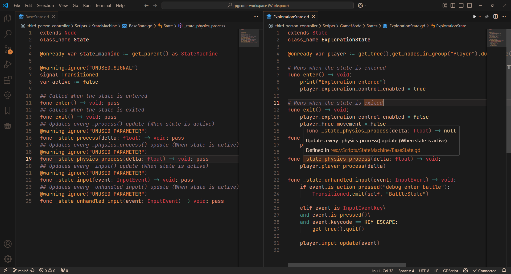

# Btarg's Cosy Orange Theme

A cosy orange theme for Visual Studio Code with low contrast and saturation, made to be easier on the eyes than other dark themes and to work well for editing GDScript late at night.

> Note: This is my personal theme, and is hacked together from other people's work. It probably won't work as well for your needs as it does for mine!

# Credits
The [Homey Theme](https://github.com/notAlaanor/homey-theme/blob/master/themes/Homey-color-theme.json) by kepler0 aka. notAlaanor has recently inspired me to redo the theme to be more cosy and less contrasty.

I was originally inspired to make this theme as a long-time enjoyer of [Gruvbox Dark Medium](https://marketplace.visualstudio.com/items?itemName=jdinhlife.gruvbox) by jdinhlife. The terminal colours and status bar in this theme were originally based on Gruvbox Dark Medium.

Syntax highlighting colours are taken mostly from the ["Warm Night Theme"](https://github.com/slanden/warm-night-theme/blob/main/themes/warm-night.json) by slanden, and slightly modified by me.

